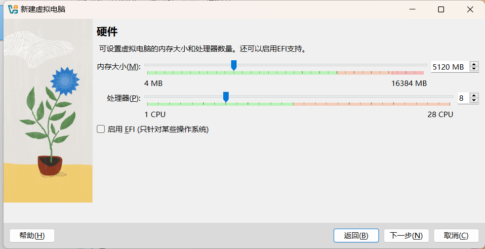
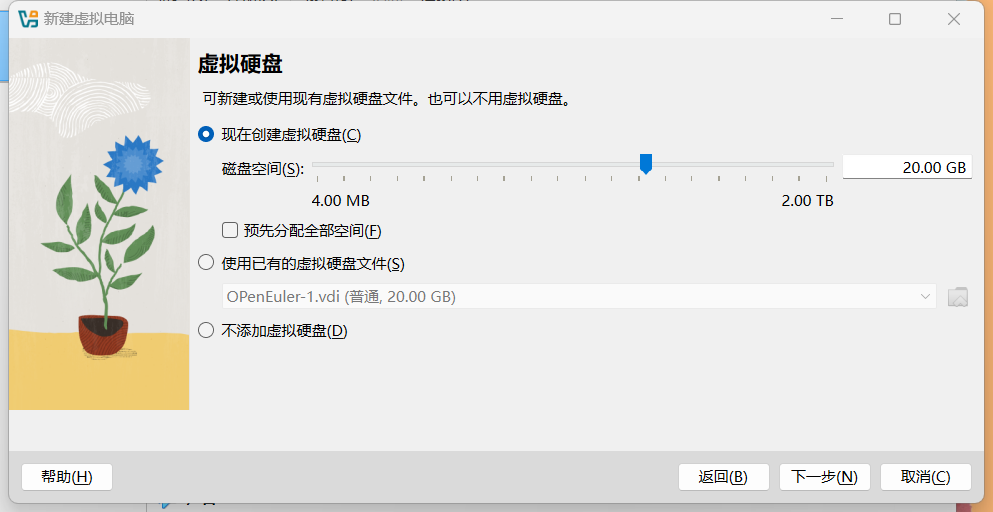
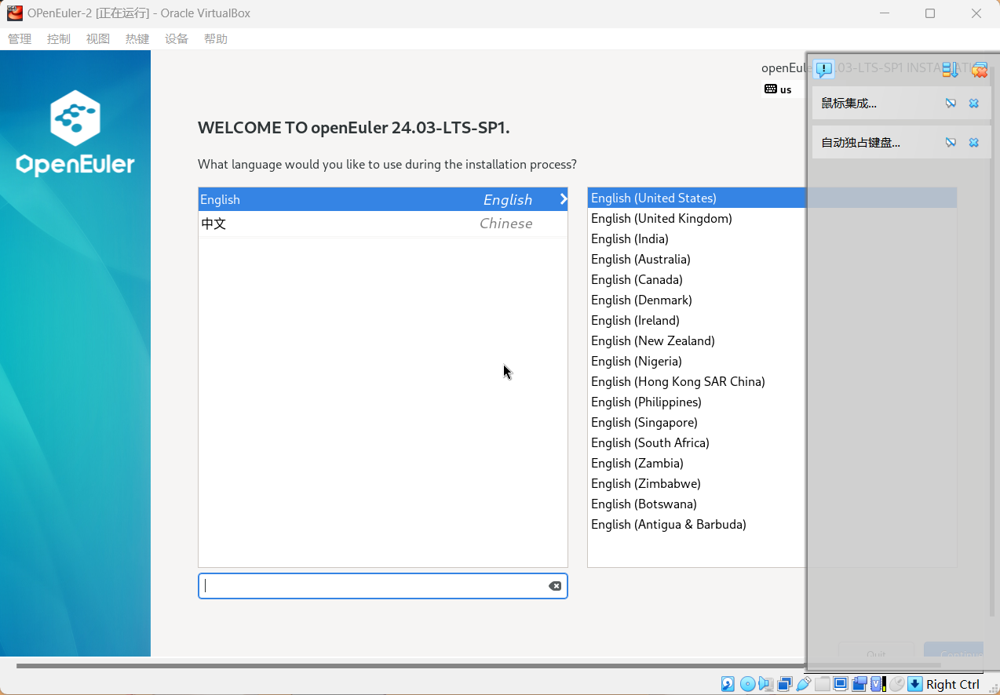
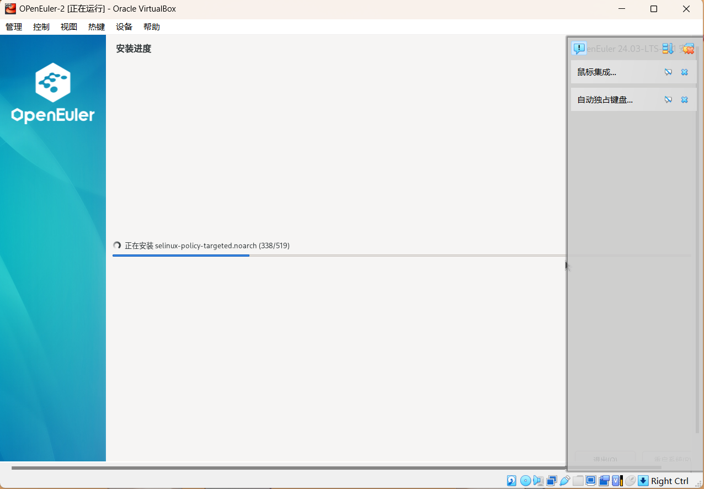
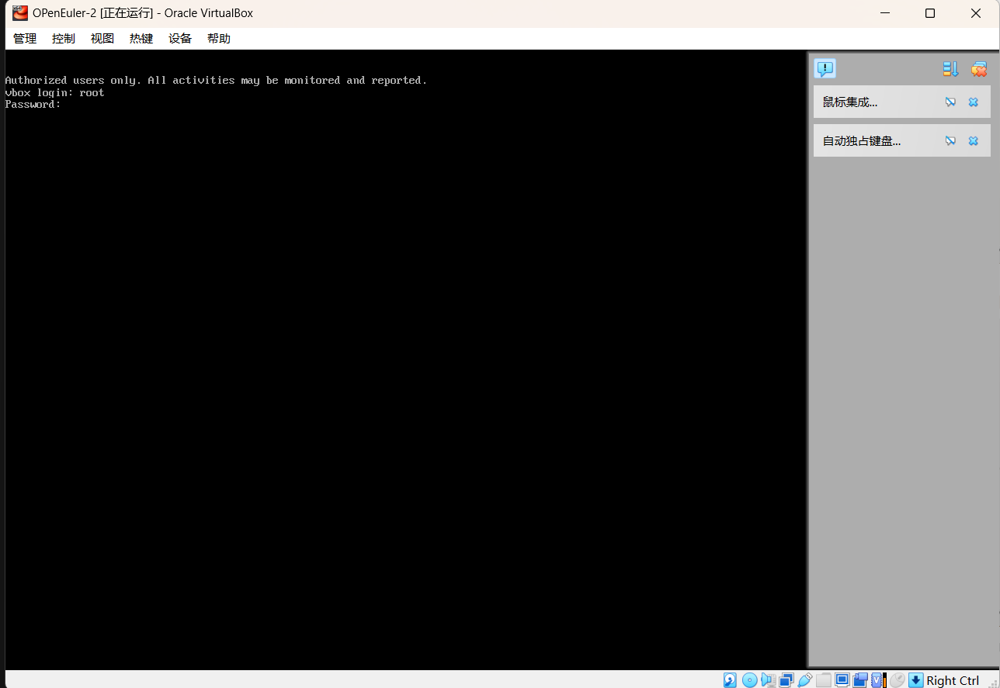
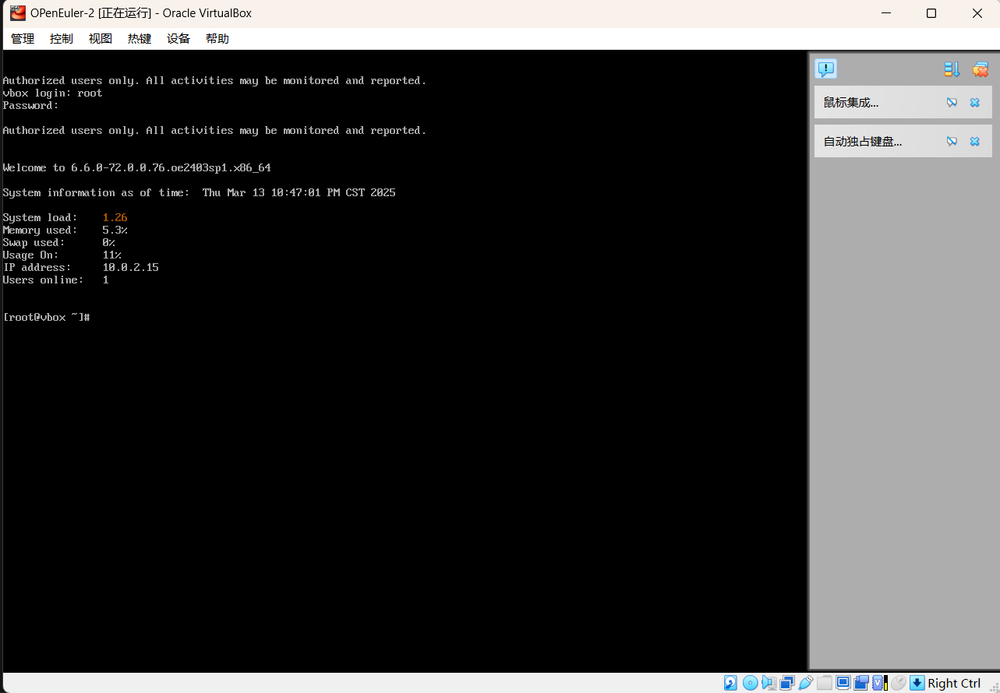
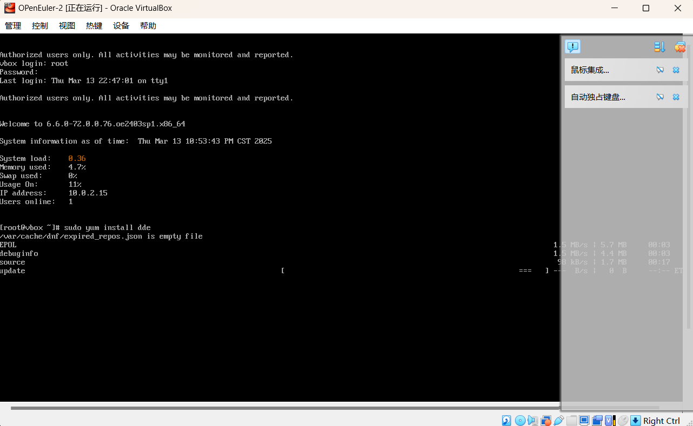
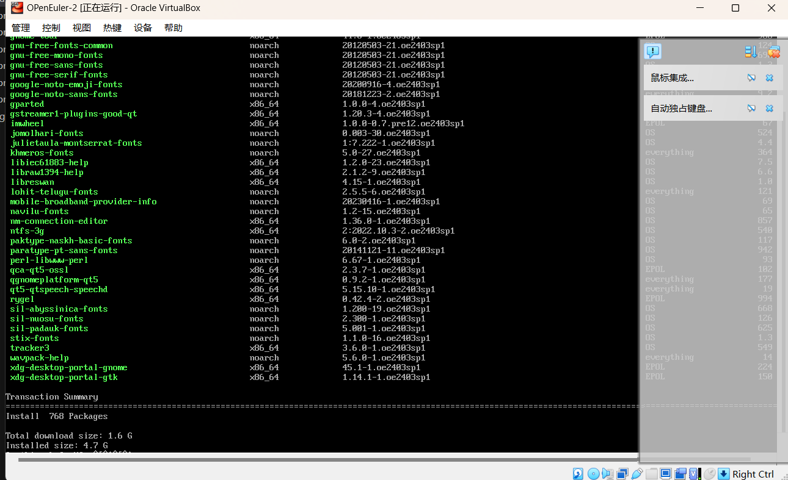
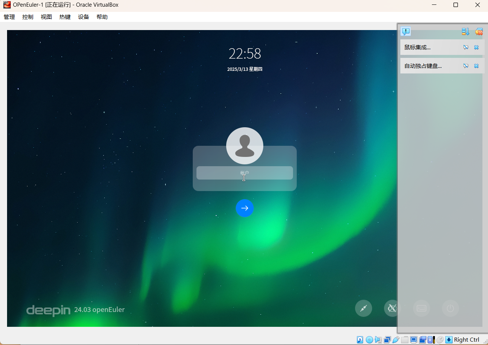

#利用VIrtualBox虚拟机安装测试OPenEuler系统环境
-
- 第一次使用MarkDown语言进行文本编辑，挺有意思的。Markdown是一种轻量级标记语言，排版语法简洁，让人们更多地关注内容本身而非排版。它使用易读易写的纯文本格式编写文档，可与HTML混编，可导出 HTML、PDF 以及本身的 .md 格式的文件。因简洁、高效、易读、易写，Markdown被大量使用，如Github、简书等。
- 安装流程：
  第一步官网下载[VirtualBox](https://www.virtualbox.org/)
  第二步打开OPenEuler社区，获取系统[镜像ISO文件](https://www.openeuler.org/zh/download/#openEuler%2024.03%20LTS%20SP1)。本人选择获取OPenEuler24.03社区版本。
  第三步打开VirtualBox，新建虚拟机，设置虚拟机参数如下：5GB内存、8核CPU、20GB虚拟磁盘大小。具体操作如下图运行虚拟机，进入初始化设置界面如下设置完成root密码，安装系统安装完成后，重启虚拟机。进入OPenEuler的服务器命令行模式。如图输入root权限密码，进入管理员模式。
  为了方便初学者操作使用，安装国产的深度自研dde图形化界面，命令行输入指令,显示如下下载界面。
  >sudo yum install dde

  
  最终获得图形界面OPenEuler系统如图。

  作者：网络2301-张俊涵-20232241040