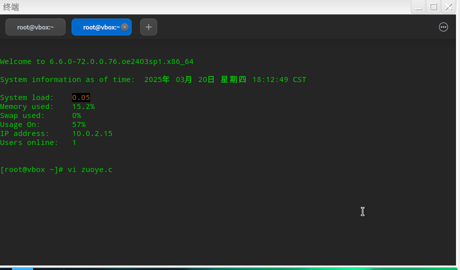
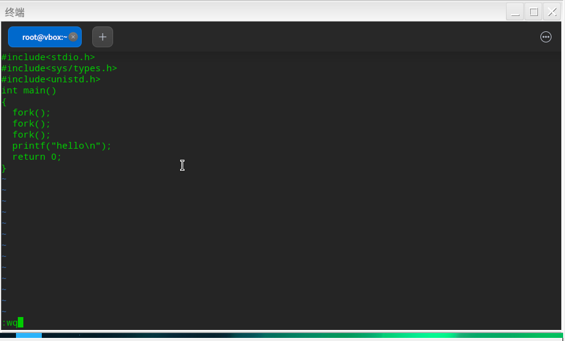
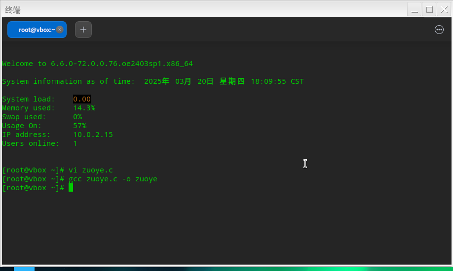
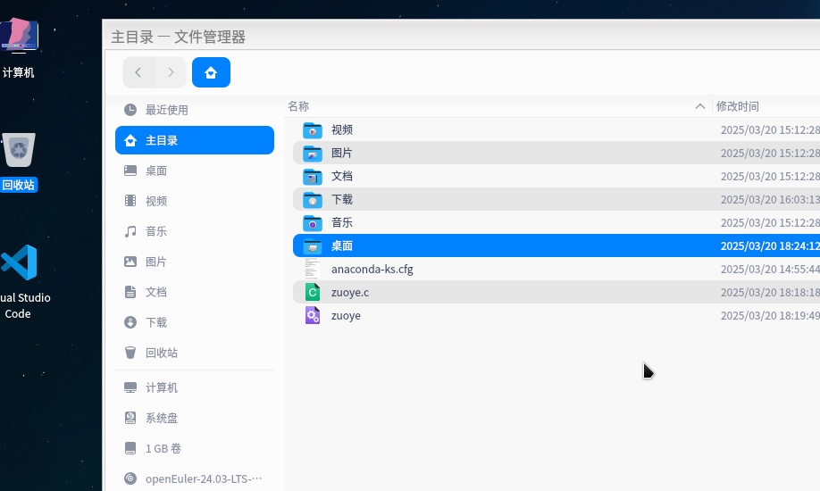
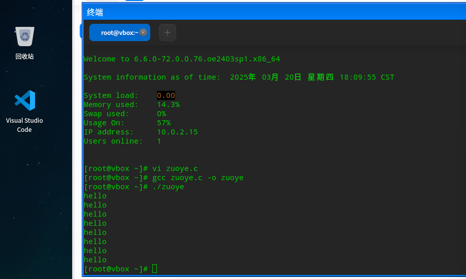
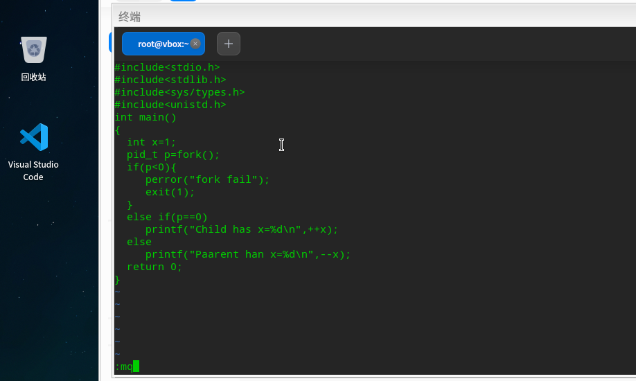
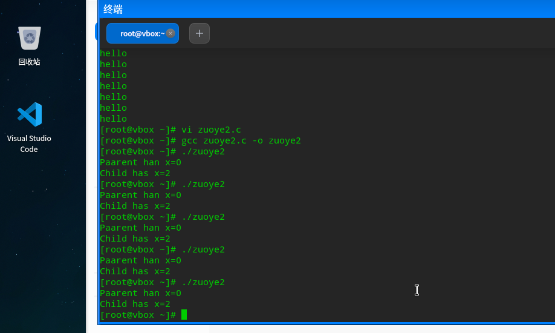

# 在liunx环境下进行系统进程创建函数fork()编译运行
在liunx环境下进行C语言代码编写是我们所不熟练的。尤其是要求在命令行终端界面进行编写操作，实话实说，一头雾水。故学习liunx命令行界面C语言编写操作是第一要务。

于是我通过广泛的的学习得到在 Linux 下通过命令行进行 C 程序源码的简单编辑、编译和执行的步骤如下：
- 编辑
可以使用文本编辑器，如  `vi` 或 `nano`。以 `vi` 为例，在终端输入 `vi 文件名.c` （如 `vi hello.c`）进入编辑模式，按 i 键进入插入模式开始编写代码，完成后按 Esc 键退出插入模式，再输入 `:wq` 保存并退出。
- 编译
使用 `gcc` 编译器，在终端输入 `gcc 文件名.c -o 可执行文件名` （如 `gcc hello.c -o hello`） ，`gcc` 会对 C 源码进行编译，并生成可执行文件。如果代码有错误，编译过程中会提示错误信息。
- 执行
编译成功后，在终端输入 `./可执行文件名` （如 `./hello`）即可运行编译

推荐优质[学习博客链接](https://blog.csdn.net/weixin_29415575/article/details/112663099)
* 接下来我将对fork()函数运行示例检测的过程进行展示：
  1、示例一：创建进程hello，测试fork()函数创建进程的基本功能
  
 2、示例二：利用fork()函数设计测试代码如下，感受进程的相对独立性。令父进程与子进程共同调用相同参数x=1，分别执行++x和--x，得到运行结果如下说明在代码中，fork()函数执行后产生了两个独立的进程：父进程和子进程。虽然它们初始时共享了变量x的值1，但在fork()之后，父子进程拥有各自独立的内存空间，对x的操作互不影响。子进程：执行++x，因为x初始值为1，自增后x变为2；父进程：执行--x，x初始值为1，自减后x变为0。

 作者：张俊涵-网络2301-20232241040